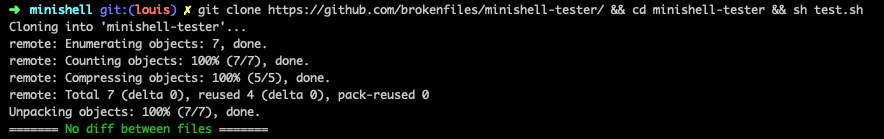

# minishell-tester

* <b>Synopsis</b> : L’objectif de ce projet est de créer un simple shell. Ca sera votre propre petit bash, ou zsh. Vous en apprendrez beaucoup sur les process et les file descriptors.

* <b>But de ce testeur</b> : Comparer votre minishell (<b>du 42cursus</b>) avec le vrai bash grâce a de nombreuses commandes et comparaisons.

* <b>Installation</b> : allez dans votre dossier minishell, et effectuez cette commande : 
  `git clone https://github.com/brokenfiles/minishell-tester/ && cd minishell-tester && sh test.sh`

* <b>Exemples</b> : 
