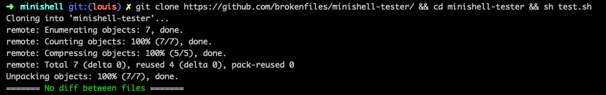
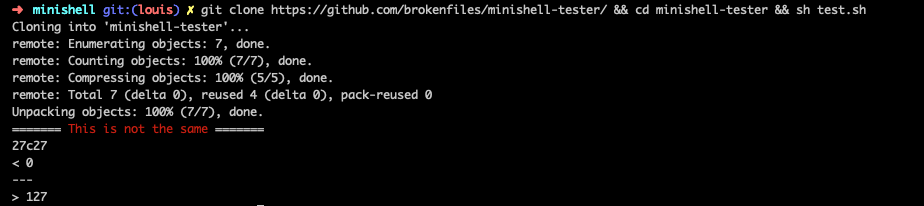

# minishell-tester

* <b>Synopsis</b> : L’objectif de ce projet est de créer un simple shell. Ca sera votre propre petit bash, ou zsh. Vous en apprendrez beaucoup sur les process et les file descriptors.

* <b>But de ce testeur</b> : Comparer votre minishell (<b>du 42cursus</b>) avec le vrai bash grâce a de nombreuses commandes et comparaisons.

* <b>Installation</b> : allez dans votre dossier minishell, et effectuez cette commande : 
  `git clone https://github.com/brokenfiles/minishell-tester/ && cd minishell-tester && sh test.sh`

* <b>Notes importantes</b> :
  - Votre minishell <b>DOIT</b> utiliser `isatty (man isatty)` pour ne pas print votre "header",
  - Vous <b>DEVEZ</b> git clone dans votre dossier minishell,
  - Vous pouvez lancer les tests avec la commande `$ sh test.sh`,
  - Vous pouvez modifier les commandes testées en modifiant le fichier `commands_test.txt` qui peut être imcomplet,
  - Il peut y avoir des erreurs dans mon testeur, <u><b>vérifiez vous même avant de noter et ne vous FIEZ PAS UNIQUEMENT AU TESTEUR.</b></u>

* <b>Auteur</b> :
  - llaurent (<b>https://profile.intra.42.fr/users/llaurent</b>)

* <b>Exemples</b> : 

  
  

